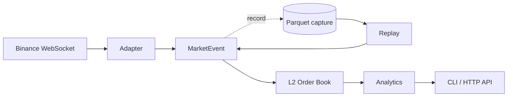

# TickForge

Real-time crypto market-data infrastructure in Python: WebSocket ingestion, L2
order-book reconstruction, microstructure analytics, Parquet storage, and
deterministic replay.

Recorded sessions re-enter the pipeline at the same seam the live feed does, so
the code that computes features from Binance is byte-for-byte the code that
computes them from disk. That property is the design constraint everything else
is arranged around, and it is what makes the stored data trustworthy enough to
research against.

Not a matching engine, not a low-latency trading system.

## Features

- **Venue-agnostic event model.** Exchange wire formats stop at the adapter.
  Nothing downstream branches on venue, field naming, or sequencing scheme.
- **Order book that fails closed.** A sequence gap or crossed book marks the
  book invalid and stops serving reads until resynchronisation completes.
  Known-invalid beats silently-wrong.
- **Binance resync implemented exactly.** Stream opens before the snapshot is
  fetched, updates buffer concurrently, and the first applied update must
  *span* the snapshot boundary rather than start at it.
- **Thirteen microstructure features**, including rolling-window order-flow
  imbalance, VWAP, and realised volatility. Windows are measured in event time,
  never wall clock.
- **Exact decimals end to end.** `Decimal` in memory, `decimal128(38,18)` in
  Parquet. Prices are order-book dict keys, so a float would silently fail to
  match or delete levels.
- **Deterministic replay.** Two replays of the same capture produce identical
  output, verified by matching SHA-256 over full CLI runs.
- **Invariants, not just examples.** Hypothesis drives the book as a state
  machine, checking after every generated operation that a valid book is never
  crossed, an invalid one refuses every read, and no zero-quantity level is
  ever stored.

## How it works



The adapter translates Binance frames into `BookSnapshot`, `BookUpdate` and
`Trade` events. `BinanceFeed` owns connection lifecycle: it buffers updates
while fetching a REST snapshot, joins the two, validates sequencing, and
resynchronises on a gap, a stale socket, or a disconnect. It emits events but
holds no book, which is what makes the stream directly recordable.

`OrderBook` is a pure state machine over those events with no clock and no
network. Analytics read it and never mutate it. Storage tees the feed, so what
lands on disk is the emitted stream rather than whatever survived a consumer's
control flow.

Both the CLI and the API drive the book from an `AsyncIterator[MarketEvent]`
and contain no branch on live versus replay. A separate replay path would
quietly become a different system, and every determinism guarantee with it.

## Tech stack

Python 3.12+, `asyncio` throughout. `websockets` and `httpx` for ingestion,
`pyarrow` for Parquet, `polars` for querying captures, FastAPI and uvicorn for
the HTTP layer. `pytest`, `hypothesis` and `pytest-benchmark` for the 193-test
suite, the invariants, and the timings. Managed with `uv`.

## Getting started

```bash
uv sync
uv run pytest
```

Watch a live feed, printing features as they compute:

```bash
uv run python -m tickforge BTCUSDT 60
```

Capture to Parquet, then replay it through the identical pipeline:

```bash
uv run python -m tickforge BTCUSDT 600 data      # record
uv run python -m tickforge replay BTCUSDT 2026-09-08          # unpaced
uv run python -m tickforge replay BTCUSDT 2026-09-08 100      # 100x
```

Profile the pipeline over a capture, or serve live state over HTTP:

```bash
uv run python -m tickforge bench BTCUSDT 2026-09-08 data
uv run uvicorn tickforge.api:app        # /docs for the endpoints
```

The API exposes `/markets/{symbol}/book`, `/features`, `/trades`, and
`/system/health`. Decimal values are JSON strings, since a JSON number becomes
a float in every client and discards the exactness the pipeline preserves.

## Project structure

```
src/tickforge/
  events.py            Normalized event types. Nothing here knows a venue exists.
  book.py              L2 reconstruction and the validity state machine.
  analytics.py         Pure book features, plus rolling-window flow features.
  storage.py           Date-partitioned Parquet writer.
  replay.py            Captures back into events, in capture order.
  api.py               FastAPI surface over live state.
  bench.py             Latency percentiles and throughput.
  adapters/binance.py       Wire format. The only file that knows Binance's field names.
  adapters/binance_feed.py  Connection lifecycle, resync, staleness.
tests/                 193 tests, roughly one line of test per line of source.
tests/test_properties.py  Hypothesis invariants, including the book as a state machine.
benchmarks/            Per-operation timings, excluded from the default suite.
docs/knowledge/        Design reasons, architectural boundaries, recorded pitfalls.
```

## Measured

From a 90-second BTCUSDT capture, 3,233 events (`python -m tickforge bench`):

| stage | p50 | p95 | p99 |
| --- | --- | --- | --- |
| book apply | 0.1 µs | 0.2 µs | 136 µs |
| flow window | 0.4 µs | 0.8 µs | 81 µs |
| all 13 features | 495 µs | 1,032 µs | 1,266 µs |
| end to end | 0.7 µs | 1.5 µs | 1,070 µs |

40,380 events/sec against a feed that delivers roughly 36/sec, so about 0.1% of
one core. Storage writes 69,175 events/sec at 81 bytes/event. The p99 tail is
entirely the feature rows, which run once per book update rather than per event.

Profiling also closed the project's largest open question. `Decimal` was
assumed to be ~20x slower than scaled integers and measured at **1.1x**: a
scaled price times a scaled quantity exceeds 64 bits, so CPython falls back to
multi-digit arithmetic anyway. The scaled-int trick buys in C++ what it does
not buy in Python.

## Future work

- A second venue, to test the claim that adding one touches a single adapter.
- Streaming merge in replay, for captures larger than memory.
- Structured logging and per-symbol API instances.

## Docs

- [Goal](docs/Goal.md) — the full ten-phase spec and success criteria.
- [Architecture](docs/knowledge/architecture.md) — boundaries, and what breaks
  when each is violated.
- [Decisions](docs/knowledge/decisions.md) — dated, with rejected alternatives.
- [Pitfalls](docs/knowledge/pitfalls.md) — traps hit and recorded, including
  the ones found while building this.
- [AGENTS.md](AGENTS.md) — conventions for AI coding agents working here.
