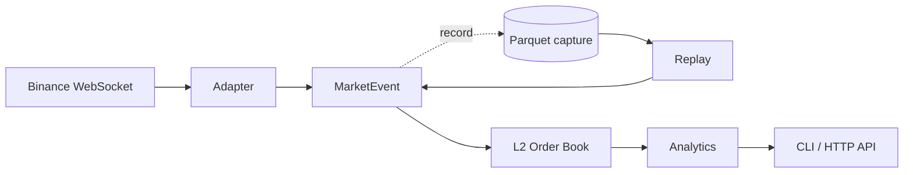

# TickForge

Real-time crypto market-data infrastructure in Python: WebSocket ingestion, L2
order-book reconstruction, microstructure analytics, Parquet storage, and
deterministic replay.

Recorded sessions re-enter the pipeline at the same seam the live feed does, so
the code that computes features from Binance is byte-for-byte the code that
computes them from disk. That property is the design constraint everything else
is arranged around, and it is what makes the stored data trustworthy enough to
research against.

Not a matching engine, not a low-latency trading system.

## Features

- **Venue-agnostic event model.** Exchange wire formats stop at the adapter.
  Nothing downstream branches on venue, field naming, or sequencing scheme.
- **Order book that fails closed.** A sequence gap or crossed book marks the
  book invalid and stops serving reads until resynchronisation completes.
  Known-invalid beats silently-wrong.
- **Binance resync implemented exactly.** Stream opens before the snapshot is
  fetched, updates buffer concurrently, and the first applied update must
  *span* the snapshot boundary rather than start at it.
- **Thirteen microstructure features**, including rolling-window order-flow
  imbalance, VWAP, and realised volatility. Windows are measured in event time,
  never wall clock.
- **Exact decimals end to end.** `Decimal` in memory, `decimal128(38,18)` in
  Parquet. Prices are order-book dict keys, so a float would silently fail to
  match or delete levels.
- **Deterministic replay.** Two replays of the same capture produce identical
  output, verified by matching SHA-256 over full CLI runs.
- **Invariants, not just examples.** Hypothesis drives the book as a state
  machine, checking after every generated operation that a valid book is never
  crossed, an invalid one refuses every read, and no zero-quantity level is
  ever stored.

## How it works



The adapter translates Binance frames into `BookSnapshot`, `BookUpdate` and
`Trade` events. `BinanceFeed` owns connection lifecycle: it buffers updates
while fetching a REST snapshot, joins the two, validates sequencing, and
resynchronises on a gap, a stale socket, or a disconnect. It emits events but
holds no book, which is what makes the stream directly recordable.

`OrderBook` is a pure state machine over those events with no clock and no
network. Analytics read it and never mutate it. Storage tees the feed, so what
lands on disk is the emitted stream rather than whatever survived a consumer's
control flow.

Both the CLI and the API drive the book from an `AsyncIterator[MarketEvent]`
and contain no branch on live versus replay. A separate replay path would
quietly become a different system, and every determinism guarantee with it.

## Tech stack

Python 3.12+, `asyncio` throughout. `websockets` and `httpx` for ingestion,
`pyarrow` for Parquet, `polars` for querying captures, FastAPI and uvicorn for
the HTTP layer. `pytest`, `hypothesis` and `pytest-benchmark` for the 193-test
suite, the invariants, and the timings. Managed with `uv`.

## Getting started

```bash
uv sync
uv run pytest
```

Watch a live feed, printing features as they compute:

```bash
uv run python -m tickforge BTCUSDT 60
```

Capture to Parquet, then replay it through the identical pipeline:

```bash
uv run python -m tickforge BTCUSDT 600 data      # record
uv run python -m tickforge replay BTCUSDT 2026-09-08          # unpaced
uv run python -m tickforge replay BTCUSDT 2026-09-08 100      # 100x
```

Profile the pipeline over a capture, or serve live state over HTTP:

```bash
uv run python -m tickforge bench BTCUSDT 2026-09-08 data
uv run uvicorn tickforge.api:app        # /docs for the endpoints
```

The API exposes `/markets/{symbol}/book`, `/features`, `/trades`, and
`/system/health`. Decimal values are JSON strings, since a JSON number becomes
a float in every client and discards the exactness the pipeline preserves.

## Testing

```bash
uv run pytest                      # all 193, ~10s, no network
uv run pytest -v                   # every test name; they read as a spec
uv run pytest tests/test_order_book.py    # one file
uv run pytest -k microprice        # by name fragment, across files
uv run pytest -x --tb=short        # stop at the first failure
```

**No test touches the network.** The feed is driven by scripted async
generators, and the HTTP layer runs a real `httpx.AsyncClient` over
`MockTransport`, so URL building, parameter encoding and `raise_for_status`
all execute for real against a fake socket. Async tests use a small
`functools.wraps` decorator rather than a plugin, which keeps the dependency
list honest.

| file | tests | covers |
| --- | --- | --- |
| `test_binance_feed.py` | 31 | Resync procedure, sequence gaps, staleness, socket lifecycle |
| `test_api.py` | 26 | Four endpoints, fail-closed responses, feed lifecycle |
| `test_storage.py` | 26 | Parquet round trip, partition rollover, batching, `capture_seq` |
| `test_order_book.py` | 23 | Snapshot loading, level updates and deletes, crossed detection |
| `test_binance_adapter.py` | 22 | Wire parsing, aggressor inversion, match-vs-emission time |
| `test_flow_features.py` | 22 | Rolling windows, event-time clock, resync handling |
| `test_analytics.py` | 19 | Spread, midprice, microprice, imbalance, depth |
| `test_replay.py` | 12 | Determinism, ordering, pacing |
| `test_properties.py` | 9 | Hypothesis invariants (each generates hundreds of cases) |
| `test_docs.py` | 3 | Markdown links resolve |

### Property-based tests

```bash
uv run pytest tests/test_properties.py -v
uv run pytest tests/test_properties.py --hypothesis-seed=random    # new inputs
uv run pytest tests/test_properties.py --hypothesis-show-statistics
```

Nine tests, but each generates hundreds of inputs. `BookLifecycle` drives
`OrderBook` as a state machine: random sequences of snapshots and updates, with
every invariant re-checked after each step. When one fails, Hypothesis shrinks
the input to the smallest sequence that still breaks it.

To stress it harder than the suite does, raise the settings on the generated
`TestCase`:

```python
from hypothesis import settings
from tests.test_properties import BookLifecycle

BookLifecycle.TestCase.settings = settings(max_examples=2000, stateful_step_count=80)
BookLifecycle.TestCase().runTest()
```

### What the tests are trying to catch

The failure mode this project is built against is not a crash. It is a number
that is wrong and looks right, so the tests are written to fail on plausible
output rather than only on exceptions.

Microprice shows both halves of that. The property test asserts only that it
lands inside the spread, which is true of the correct formula *and* of the
version with the weights paired the obvious wrong way. So the direction is
pinned by example instead, with deliberately unequal sizes on the two sides:
`test_microprice_leans_toward_the_lighter_side` fails against the wrong
weighting, where a balanced fixture could not tell them apart.

The same shape recurs. Order-flow imbalance returning `0` after a resync is
indistinguishable from a genuinely balanced market, so a test asserts `None`.
A one-sided book, by contrast, has a real imbalance of exactly `±1`, and a
separate test pins that it does *not* go unknown.

`test_replaying_twice_gives_identical_output` is the headline: it captures a
session, replays it twice, and asserts the two feature streams are equal. Two
full CLI replays were also checked to produce matching SHA-256 output.

### Looking at what a run actually did

Tests leave nothing behind; they write to temp directories and delete them.
Captures are the durable record, and they live in
`data/binance/<SYMBOL>/<date>/`. Parquet is binary, so:

```bash
uv run python -m tickforge BTCUSDT 60 data       # record something first
uv run python scripts/show_capture.py            # today
uv run python scripts/show_capture.py 2026-09-08 # a specific day
uv run python scripts/show_capture.py 2026-09-08 csv   # also write CSVs
```

It prints the first rows of each stream, then the check that matters:

```
book updates : 30
sequence gaps: 0   (0 means the book saw every update)
covering     : 13,576 exchange sequence numbers
```

Zero gaps across 13,576 sequence numbers means the book accounted for every
update Binance issued during the capture. That single line is the clearest
evidence the reconstruction is correct on real data rather than on fixtures.

`csv` writes one file per stream beside the Parquet, with book levels exploded
to one row per level and decimals emitted as text so a spreadsheet cannot
round them back into floats. Output stays under `data/`, which is gitignored,
so market data cannot end up committed.

### Benchmarks

Excluded from the default suite via `testpaths`, because a suite you hesitate
to run stops catching things.

```bash
uv run pytest benchmarks/ --benchmark-columns=median,ops --benchmark-sort=mean
uv run python -m tickforge bench BTCUSDT <date> data    # whole pipeline
```

Nothing asserts a threshold. A benchmark that fails on a busy laptop teaches
nothing; these exist to be read and re-run after a change.

## Components

Each stage below owns one job and hands the next a type, not a method call.
Where a component enforces an architectural rule, the rule is named, because
that is usually the reason the boundary sits where it does.

### `events.py` — the contract

`BookSnapshot`, `BookUpdate`, `Trade`, and the `MarketEvent` union of the
three. Frozen slotted dataclasses, prices and quantities as `Decimal`,
timestamps as integer nanoseconds. `Side` is a `StrEnum` so it writes to
Parquet and JSON with no conversion step.

Every field is venue-neutral. Widening the union is an API change, not an
addition: every `isinstance` dispatch downstream gains a case it does not
handle, which is exactly what happened when `Trade` was introduced.

### `adapters/` — the only place Binance exists

`binance.py` is pure translation. `parse_depth_update`, `parse_trade`,
`parse_snapshot` and `parse_stream_frame` turn wire bytes into events, and
Binance's field names (`U`, `u`, `b`, `a`, `m`) appear nowhere else in the
codebase. It resolves the two Binance quirks that matter: `T` (match time)
rather than `E` (emission time), and the maker flag inverted into an aggressor
`Side`.

`binance_feed.py` owns connection lifecycle. `BinanceFeed.run()` opens the
combined depth-and-trade stream, buffers updates while `fetch_snapshot` runs
concurrently, joins them with `updates_after_snapshot`, then validates every
subsequent update. `require_fresh` wraps the socket in a per-message timeout,
so a connection that stays open while delivering nothing raises instead of
hanging. `SequenceGapError`, `SnapshotTooOldError` and `StaleFeedError` all
subclass `ResyncRequired`, so recovery is one path: fetch a new snapshot.

The feed's sequence check deliberately mirrors the book's. A feed laxer than
the book it feeds would let through an update the book rejects, and the book
would go invalid permanently with nothing able to resynchronise it.

### `book.py` — reconstruction

`OrderBook` maintains two `dict[Decimal, Decimal]` sides and a lifecycle:
`EMPTY → SEEDED → SYNCED`, with `INVALID` reachable from either. `apply`
returns an `ApplyResult` rather than raising, because gaps are routine; reads
(`best_bid`, `top_bids`, …) raise `BookInvalidError` instead, because serving
a known-wrong number is not.

The two guards are independent on purpose. A caller who ignores the result
still cannot get plausible wrong numbers out of the book.

No clock, no network, no venue knowledge. That is what makes it identical
under live and replay, and testable without either.

### `analytics.py` — features

Two kinds, and the split is the design. The **pure functions** (`spread`,
`midprice`, `microprice`, `market_depth`, `imbalance`) read a book at one
instant and never mutate it. **`FlowFeatures`** holds a rolling window for the
four that measure change or accumulation: order-flow imbalance, trade
imbalance, VWAP, realised volatility.

That window is the only clock in the pipeline, and it runs on event time. A
wall clock would place every recorded event outside the window during replay,
returning nothing for the whole run after working perfectly live.

`feature_snapshot` collects all thirteen into a `FeatureSnapshot`. Nearly
every field is nullable and the nulls carry meaning: a one-sided book has no
midprice, an empty window no VWAP, and a window spanning a resync no order
flow. `None` is *undefined*, never zero.

### `storage.py` — persistence

`EventStore` writes date-partitioned Parquet, one file per event type per
capture session, buffering into row groups. `record()` tees the feed rather
than each consumer calling `write()`, so the recorded stream is *definitionally*
the emitted stream instead of whatever survived a caller's control flow.

Prices are `decimal128(38,18)`. Each row carries a `capture_seq` because
neither timestamp column can order the stream: `time.time_ns()` resolves to
~0.6 ms on this machine so events collide, and the exchange clock leads it far
enough that an event's timestamp can precede its own arrival.

### `replay.py` — the same events, from disk

`read_partition` reads a day back into `MarketEvent`s ordered by
`(session, capture_seq)`. `replay` yields them at the seam `BinanceFeed.run()`
yields at, optionally paced by their original arrival gaps.

Pacing is the one permitted wall clock in the system: it changes *when* an
event appears, never what it is. Two replays at different speeds produce
identical output, and a test asserts it.

### Interfaces

`__main__.py` holds `consume()`, which drives book, analytics and storage from
an `AsyncIterator[MarketEvent]` and **contains no branch on live versus
replay**. `watch` feeds it a socket, `rerun` feeds it a file. That absence of a
branch is the architectural claim, made load-bearing rather than asserted.

`api.py` runs the feed in a background task and serves the state it maintains
over four endpoints. Handlers are `async` deliberately: a synchronous handler
would run in a thread pool and could read the book mid-update.

`bench.py` profiles the pipeline over a recorded capture, so two runs measure
identical work. That reproducibility is what separates a benchmark from a
stopwatch.

### Layout

```
src/tickforge/
  events.py                 Normalized event types and the MarketEvent union.
  book.py                   L2 reconstruction and the validity state machine.
  analytics.py              Pure book features, plus the rolling-window ones.
  storage.py                Date-partitioned Parquet writer and the record tee.
  replay.py                 Captures back into events, in capture order.
  api.py                    FastAPI surface over live state.
  bench.py                  Latency percentiles, throughput, memory.
  __main__.py               CLI: watch, capture, replay, bench.
  adapters/binance.py       Wire format. The only file that knows Binance.
  adapters/binance_feed.py  Connection lifecycle, resync, staleness.
tests/                      193 tests, roughly one line of test per line of source.
tests/test_properties.py    Hypothesis invariants; the book as a state machine.
benchmarks/                 Per-operation timings, excluded from the default suite.
scripts/show_capture.py     Print or export a capture; checks sequence continuity.
docs/knowledge/             Design reasons, boundaries, recorded pitfalls.
docs/superpowers/specs/     Design docs for storage and replay, with rejects.
```

## Measured

From a 90-second BTCUSDT capture, 3,233 events (`python -m tickforge bench`):

| stage | p50 | p95 | p99 |
| --- | --- | --- | --- |
| book apply | 0.1 µs | 0.2 µs | 136 µs |
| flow window | 0.4 µs | 0.8 µs | 81 µs |
| all 13 features | 495 µs | 1,032 µs | 1,266 µs |
| end to end | 0.7 µs | 1.5 µs | 1,070 µs |

40,380 events/sec against a feed that delivers roughly 36/sec, so about 0.1% of
one core. Storage writes 69,175 events/sec at 81 bytes/event. The p99 tail is
entirely the feature rows, which run once per book update rather than per event.

Profiling also closed the project's largest open question. `Decimal` was
assumed to be ~20x slower than scaled integers and measured at **1.1x**: a
scaled price times a scaled quantity exceeds 64 bits, so CPython falls back to
multi-digit arithmetic anyway. The scaled-int trick buys in C++ what it does
not buy in Python.

## Future work

- A second venue, to test the claim that adding one touches a single adapter.
- Streaming merge in replay, for captures larger than memory.
- Structured logging and per-symbol API instances.

## Docs

- [Goal](docs/Goal.md) — the full ten-phase spec and success criteria.
- [Architecture](docs/knowledge/architecture.md) — boundaries, and what breaks
  when each is violated.
- [Decisions](docs/knowledge/decisions.md) — dated, with rejected alternatives.
- [Pitfalls](docs/knowledge/pitfalls.md) — traps hit and recorded, including
  the ones found while building this.
- [AGENTS.md](AGENTS.md) — conventions for AI coding agents working here.
